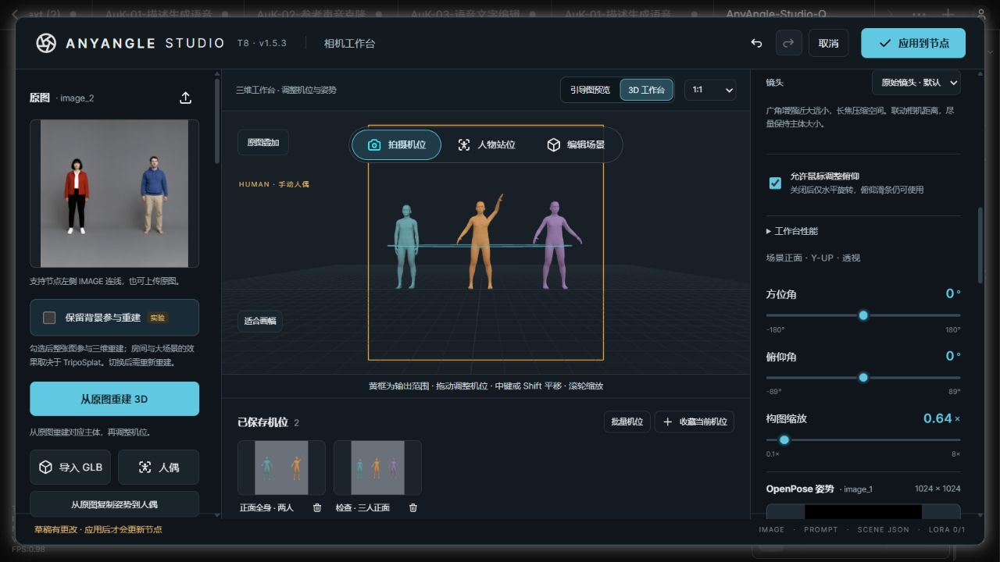

# 1.5.3 联合检查

[简体中文](#检查记录) · [English](#english)

2026-10-05，基于 v1.5.2（`66fc581`）重新检查。主 Agent 负责前端 10 项，独立子 Agent 负责后端 10 项；以下记录本轮新探针及回归结果。

确认并修复五类问题：

- **收藏失败丢失历史与相机状态。** 缩略图捕获失败会清空重做记录，撤销满 40 项时丢失最早项；从编辑模式收藏时还留下已修改的相机。现在恢复场景、模式、选中收藏与历史，恢复再次失败也保留原始错误。
- **浏览器姿势库不一致。** 损坏条目可能中断工作台打开；存储满或不可写时，保存留下未持久化条目、删除丢失内存条目。现在过滤无法展示的条目，先写入存储再更新列表，失败明确提示并保留原列表。
- **错误上传请求返回 500。** 非 multipart 或嵌套 multipart 在资产、场景上传中触发未处理错误。现在在上传边界返回 400，不写入资产。
- **无效引导类型返回 500。** 列表或对象类型的 `conditioning.guide` 使保存、场景导出失败。现在返回明确的 400，合法模式不变。
- **Windows 并发保存访问拒绝。** 多个线程同时检查、替换相同资产，实际触发读取和替换的权限错误。现在同一插件进程的多个存储实例共享写锁；替换被拒绝时，只有目标已包含完全相同数据才按幂等成功处理，其他磁盘错误仍保留。

## 检查记录

| 项 | 范围 | 本轮结果 |
| --- | --- | --- |
| 1 | 上传边界 | 两个接口共 8 个错误格式、空请求、嵌套请求均为 400，零写入。 |
| 2 | JSON 与引导类型 | 7 个 JSON 接口及引导类型共 27 个错误请求均为 400。 |
| 3 | 实际图片上传 | JPEG、WebP、CMYK TIFF、索引 GIF 上传与 GET 成功，统一 RGB PNG；无效 GLB 为 400。 |
| 4 | Windows 并发存储 | 12 实例、12 线程，5 个全新目录，共 480 次机位保存；0 权限异常、哈希错误或临时文件残留。 |
| 5 | 便携场景依赖 | 7 人含 3 个隐藏人物、2 个模板阵容及结构图、道具；21 个资产跨存储恢复可读，token 相同。 |
| 6 | 导入失败原子性 | 尺寸错误、无效模板接触、额外条目、缺失资产四种 ZIP 零写入，随后合法导入可恢复。 |
| 7 | 大批量持久化 | 65 个不同画幅、焦距、平移和自定义提示词机位；ZIP 66 条目，逐张 PNG 与任务元数据一致。 |
| 8 | 原生动态入口 | 实际 V3 Autogrow 的 0/1/99/100 身份入口归一化通过；不截断额外参考、不改变已存资产。 |
| 9 | 输入冻结 | POSE、Depth、Canny 与关键点连线变化均要求重新应用；相同输入可执行。 |
| 10 | 原生编码契约 | CPU 原生 Qwen 编码器，参考预算 0/32/96/512；保留全部参考，首张引导确定 latent 画幅。 |
| 11 | 收藏失败与取消 | 3 个失败测试修复前失败、修复后通过；取消命名不改历史。实际 ComfyUI 收藏、撤销与重做成功。 |
| 12 | 浏览器姿势库 | 损坏条目、保存失败、删除失败均先复现后修复；正常保存与删除仍保持显示、存储一致。 |
| 13 | 角色选择与随机 | 新 48 组隐藏、锁定、作用范围与排序组合；种子按稳定角色 ID 重现，复制不串身份。 |
| 14 | 不同阵容模板 | 新 9 组人数不等、角色 ID 部分重叠模板；保留现有身份，接触映射只引用有效人物。 |
| 15 | 焦距与极端画幅 | 新 120 组宽高比、焦距与缩放，目标平面位置和大小保持，误差小于 `1e-10`。 |
| 16 | 半身与缺失关节 | 新 48 组裁切、平移、缩放姿势复制；可见方向一致，不补造未观察到的肢体。 |
| 17 | 图片与三维引导切换 | 新 12 组来源、引导类型；静态图片不套用三维批量机位，三维可用类型正常启用。 |
| 18 | 批量后段失败 | 第 3/14/31 个机位在捕获、保存、入队失败共 9 组；停止、不重试，保留已保存项及正确进度。 |
| 19 | 空 Canny 与提示词 | 新 9 组不同尺寸和阈值，空图保留、有效轮廓非空；四种引导的单图与自定义提示词保持契约。 |
| 20 | 真实 WebGL 与生命周期 | Intel D3D11：3/6/9 人输出正确，切人相机稳定；重复使用维持 16 几何体 / 10 纹理，空闲 1 次绘制。36 组 DPR、画幅、焦距捕获前后稳定。 |

完整回归：**186 项 JavaScript + 97 项 Python，283 项全部通过**。新增前端边界探针 **255 组**；真实硬件 3/6/9 人平均切换为 **22/23/22ms**，不代表所有设备的性能。

本轮没有重跑大型模型生图或 ONNX 推理。原生 CPU 编码使用小型 Clip/VAE 接口对象验证参考、latent 和 conditioning 契约；高参考数量不代表生成质量保证。写锁覆盖同一插件进程，未验证多个独立 ComfyUI 进程共用同一个输入目录。[已有生成实测与限制](multi-person-validation.md)仍适用。

更新后重启 ComfyUI，关闭旧工作台并按 `Ctrl+F5` 刷新，确认标题 **T8 · v1.5.3**。

## English

A fresh parent/child audit against v1.5.2 covered 20 scopes above. Five defect classes were reproduced and fixed: failed bookmark captures discarded history and camera state; invalid browser pose entries and storage failures left inconsistent libraries; malformed uploads returned HTTP 500; nontext guide settings returned HTTP 500; concurrent immutable writes encountered Windows access errors.

Bookmark failure restores the previous scene, mode, selected bookmark and history while preserving the primary error. Pose library changes become visible only after storage succeeds. Upload and guide validation return HTTP 400 without writing assets. A shared process lock protects idempotent reads and atomic writes across store instances; a denied replacement succeeds only if the destination already contains identical bytes. Other disk errors remain errors.

All **186 JavaScript and 97 Python tests passed**. New frontend probes covered **255 combinations**. Real HTTP tests verified uploads, JSON boundaries, frozen inputs and portable archives. Five fresh directories, 12 store instances and 12 threads completed **480 camera saves** without permission errors, corrupt hashes or temporary-file leaks. A 65-view archive retained each image and task metadata. Native V3 normalization retained 0/1/99/100 identity inputs.

Actual ComfyUI verified bookmark cancellation, saving, undo and redo. Intel D3D11 verified rendering, source changes, Fisher import, Depth/Canny, 36 frame/lens/DPR cases and resource release. Switching 3/6/9 actors averaged **22/23/22ms**; this is a local measurement, not a device-wide promise.

This round did not rerun large-model generation or ONNX inference. Native CPU encoding uses small Clip/VAE interface objects to verify contracts, not image quality. The first actual reference still determines the native latent canvas. Extra references and legal black guides remain executable. The write lock covers one plugin process; multiple independent ComfyUI processes sharing a directory were not tested. [Existing generation limits](multi-person-validation.md#english) still apply.

Restart ComfyUI and refresh with `Ctrl+F5`; the header should show **T8 · v1.5.3**.
