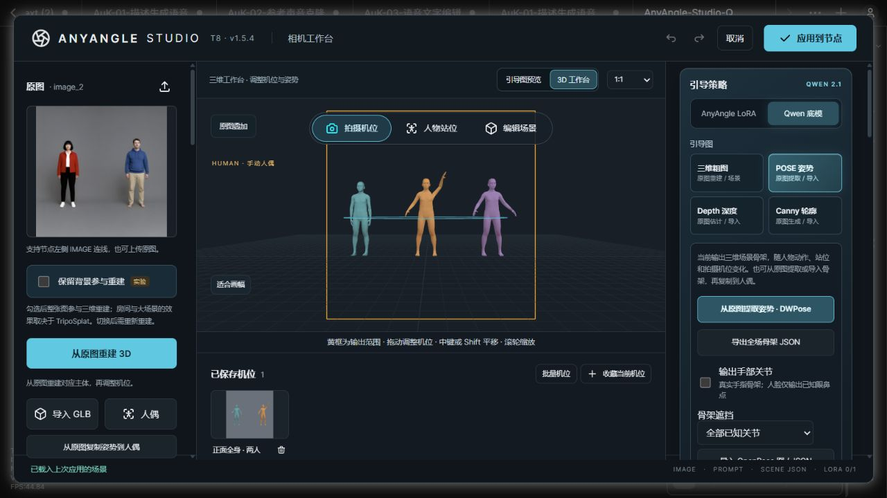

# 1.5.4 联合检查

[简体中文](#检查记录) · [English](#english)

2026-10-05，基于 v1.5.3（`8fc14bc`）重新检查。主 Agent 检查前端 10 个范围，独立子 Agent 检查后端 10 个范围并交叉复核前端修复。

确认并修复四类问题：

- **侧面与背面平移方向错误。** 人偶和 GLB 将屏幕拖动直接写到世界 X/Y 轴，侧面视角无法水平移动，背面方向反转。现在按拍摄相机方向转换到已有世界坐标；TripoSplat 保持原有相机局部坐标，已保存的机位含义不变。
- **编辑与站位模式的视图导航失效。** 中键被拍摄相机处理器截断，拍摄构图变化而工作视图不动。现在两种模式使用视图控制器，中键平移、右键环绕，拍摄机位保持不变。从编辑切到站位保留自由视角。
- **无操作或取消拖动丢失历史。** 单击画面、0.1° 小数角度的零距离移动、关闭鼠标俯仰后只竖拖，以及缩放到边界都会误清空重做；Escape 取消也未恢复历史。现在实际变化才开始记录，取消时恢复机位或人物位置、完整 40 项历史及按钮状态。
- **指针干扰与异常中断。** 其他指针的移动、松开可以改变或结束主拖动；失去鼠标捕获后仍继续移动。现在仅处理开始拖动的指针，额外按下不覆盖原记录，捕获丢失与系统取消都回滚。真实浏览器释放捕获的复现中，修复前 0.1° 漂到 -24.4°，修复后保留 0.1° 和可用重做。

## 检查记录

| 项 | 范围 | 本轮结果 |
| --- | --- | --- |
| 1 | 人偶水平平移 | 四种方位角 × 两种俯仰角，屏幕方向投影正确；真实原生鼠标事件复验。 |
| 2 | 垂直、GLB 与镜头平移 | 人偶/GLB × 四方位 × 两俯仰 × 两方向，共 32 个真实浏览器用例；包含 24/85mm 和横竖画幅，另一轴不漂移。 |
| 3 | 编辑 → 站位视图导航 | 原生右键环绕后切换模式不跳转；两模式中键确实移动视图，拍摄参数及输出 PNG 完全相同。 |
| 4 | 无操作与小数角度 | 单击、0.1° 零移动、关闭俯仰后的竖拖、缩放边界保留重做；实际 ComfyUI 单击后重做仍可恢复 0.1°。 |
| 5 | 拖动取消与历史 | Escape、pointercancel 恢复完整历史、按钮及相机；实际浏览器取消后重做正常。人物拖动取消恢复站位，正常完成只记录一次。 |
| 6 | 指针归属与捕获生命周期 | 外来 move/up/cancel、额外 down 不干扰主拖动；真实 DOM releasePointerCapture 后回滚，随后移动不再改变机位。子 Agent 31 项独立交叉测试全部通过。 |
| 7 | 引导输出与资源稳定 | 平移后人偶粗图/POSE/Depth/Canny 与 GLB 粗图/Depth/Canny 均按请求尺寸输出，捕获不改工作台画布、位置和投影；TripoSplat 的已有局部平移坐标通过事件回归。 |
| 8 | 平移机位收藏与批量 | 原生中键平移后的机位收藏可恢复完全相同 PNG；两机位批量保留 XYZ 偏移和俯仰，结束后原机位及 PNG 完全恢复。 |
| 9 | 多人操作与生命周期 | 实际 DOM 添加/复制/删除/撤销、多人 Fisher 图、照片选人、模板、道具和 Depth/Canny 通过；100 次切人维持 16 几何体/10 纹理，空闲 1 次绘制。 |
| 10 | 预览与导出投影 | 真实 Intel D3D11，4 种 DPR × 3 画幅 × 3 焦距共 36 组，捕获前后状态不变；工作台黄框与输出投影最大差异 `6.67e-16`。 |
| 11 | 动态身份映射 | 6 人、30 种排序/删除/隐藏/锁定/绑定组合，实际 Studio 执行中的照片编号和提示词正确，不覆盖已存资产。 |
| 12 | 共享照片的便携场景 | 4 人共享照片但来源区域不同；12 个独立存储目录连续 ZIP 往返，token、文档和资产 SHA 相同。 |
| 13 | 并发导入、导出与读取 | 96 个真实并发 HTTP 请求全部 200，ZIP CRC、PNG 字节、文档及文件集合一致。 |
| 14 | 损坏与缺失资产恢复 | 资产读取和场景导出返回明确 404；重传原图恢复同名资产，原快照不变，无需重启测试服务。 |
| 15 | BODY_25 与多人关键点 | 三种画幅读取三人、70 面点和手部，正确映射髋部，保留低置信缺失腿；按首帧约定处理，空 people 与合法黑图正常。 |
| 16 | 原生 TripoSplat 参数 | 实际 CPU 原生预处理、Lanczos 中间图及 PLY 写入，6 组裁切/背景组合的 crop、Gaussian 数量、相机、bounds 与背景元数据正确。 |
| 17 | 模型目录变化 | 7 组 catalog 与 4 个真实 native folder_paths 磁盘缓存变化请求，删除、恢复、重命名后立即返回当前目录状态。 |
| 18 | EXIF 转向与坐标 | 8 种方向通过真实上传，每像素与标准转向一致，正确尺寸并移除 orientation；合法黑图保留。 |
| 19 | 原生共享身份编码 | 四种引导 × 两图像顺序共 8 组；实际 native Qwen CPU 入口保留全部参考，隐藏人物过滤正确，首张图按原生 32 倍数确定 latent。 |
| 20 | 连续应用与旧快照 | 8 次连续修改引导、提示词、焦距、机位、姿势与可见性，每次输出与存档一致，之前的 token 仍可准确回读。 |

完整回归：**217 项 JavaScript + 97 项 Python，314 项全部通过**。本轮后端共 **128 个真实 HTTP 请求**通过，没有修改公共 Python 文件。实际 ComfyUI 已重新打开 **T8 · v1.5.4**；测试草稿未应用，原已保存三人场景恢复，已有 ComfyUI 服务未重启。

本轮验证了真实浏览器交互与显卡渲染，没有重跑大型模型生成或 ONNX 推理。原生 CPU TripoSplat 使用小型实际张量验证预处理与输出；原生 Qwen 编码使用小型 Clip/VAE 接口对象验证图片、conditioning 和 latent 契约。跨目录往返不代表在 12 台电脑安装。[已有生成实测与限制](multi-person-validation.md)仍适用。

更新后重启 ComfyUI，关闭旧工作台并按 `Ctrl+F5` 刷新，确认标题 **T8 · v1.5.4**。

## English

A fresh parent/child audit against v1.5.3 covered the 20 scopes above. Four defect classes were reproduced and fixed:

- Human/GLB middle-button and Shift panning now follows the camera's screen axes at side and rear views. Existing world-space camera settings and TripoSplat's camera-local offsets retain their meaning.
- Edit and actor-position navigation now uses middle-button pan and right-button orbit without changing the capture camera. Switching between these modes preserves the free view.
- Unchanged clicks, fractional angles, disabled mouse pitch and zoom limits preserve redo. History begins only when a value changes. Escape or cancellation restores the camera/actor transform, full history and button state.
- A drag belongs to its initiating pointer. Foreign events and extra pointer presses cannot replace it. Lost pointer capture rolls back; a native browser test reproduced the old 0.1° to -24.4° drift and confirmed the fix preserves 0.1° and usable redo.

All **217 JavaScript and 97 Python tests passed**. Independent cross-review passed 31 pointer cases. Actual Intel D3D11 tests verified **32 native pan combinations**, seven source/guide captures, actor movement/cancellation, exact bookmark replay and a two-view batch restoring the original PNG. **36 DPR/frame/lens cases** matched the output projection to within `6.67e-16`; repeated actor switching retained 16 geometries and 10 textures with one idle draw.

Backend probes passed **128 real HTTP requests**, including 96 concurrent requests, 30 identity mapping combinations, 12 portable-scene round trips, eight EXIF orientations, BODY_25/face/hand keypoints, actual model-directory cache changes, six native TripoSplat parameter combinations, eight native CPU Qwen encoding contracts and eight saved revisions. Public Python code was unchanged.

Actual ComfyUI reopened v1.5.4 and verified that a viewport click preserves usable redo. The original saved three-person scene was restored; the test draft was not applied and existing services were not restarted. This round did not rerun large-model generation or ONNX inference. CPU encoding uses small Clip/VAE interface objects; reconstruction probes use small actual tensors rather than generation weights. [Existing generation evidence](multi-person-validation.md#english) remains applicable.

After updating, restart ComfyUI, close the old studio and reload with `Ctrl+F5`. Confirm **T8 · v1.5.4** in the reopened header.
