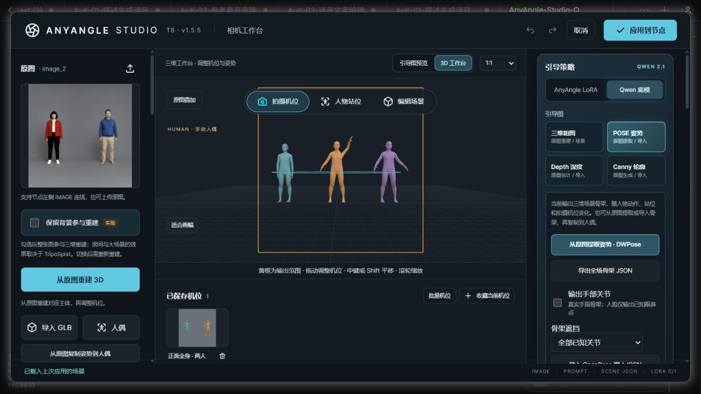

# 1.5.5 联合检查

[简体中文](#检查记录) · [English](#english)

2026-10-05，基于 v1.5.4（`19ace697`）重新检查。主 Agent 检查前端 10 个范围，独立子 Agent 检查后端 10 个范围，并实测交叉复核前端修复。

确认并修复三类问题：

- **OpenPose 骨架缩到左上角。** 原版 OpenPose 的身体、手和脸可以使用 0–1 归一化坐标，原先被当作像素处理。现在按部位识别坐标单位，再绘制骨架和计算人物选区；原始数组、缺失关节和输入签名保留。修复前头部 X 应为 128，实际为 0.2；修复后像素位置及多人选区正确。
- **拖动覆盖滚轮缩放。** 旋转或平移过程中滚动滚轮，下一次鼠标移动会恢复按下时的缩放。现在滚轮与这次拖动共用一次历史，后续移动保留新缩放；Escape 可回滚完整操作，正常松开后一次撤销即可恢复。
- **新操作受到旧拖动干扰。** 拖动中撤销、切换人物、删除人物或用键盘修改控件，旧指针记录仍能继续修改状态或抹掉新历史；原生 IK 手脚拖动也会误改撤销后的姿势或新人物。现在先结束旧拖动，再处理新操作；提交时避免将正在编辑的控件回写旧值。俯仰开关和数字输入分别保留独立撤销记录，IK 沿用原生交互清理方法。

## 检查记录

| 项 | 范围 | 本轮结果 |
| --- | --- | --- |
| 1 | 旋转期间滚轮缩放 | 真实 Chromium 鼠标按下、移动、滚轮、再移动；新缩放保留，一次撤销恢复原机位。 |
| 2 | 平移期间滚轮缩放 | 原生中键与滚轮交错；缩放不重置，XYZ 偏移与缩放一起撤销。 |
| 3 | 滚轮开始的拖动取消 | 先滚轮再移动、Escape、松开；完整相机及原重做状态恢复。 |
| 4 | 按住鼠标时撤销 | 相机与 IK 拖动中原生 Ctrl+Z 后继续移动和松开不再改变已恢复状态；相机重做恢复已拖机位。 |
| 5 | 拖动人物时切换角色 | 原生 Alt+方向键切人后继续移动，前一人物站位保持在切换时的位置，新人物姿势不受旧 IK 拖动影响。 |
| 6 | 拖动期间删除人物 | Delete 后 Escape 不清除删除历史；一次撤销恢复被删人物。 |
| 7 | 同步控件和交叉复核 | 相机/IK 拖动时键盘修改俯仰开关，及相机角度/提示词输入，保留新设置；两次撤销分别恢复控件和前一拖动。子 Agent 六项独立浏览器复核通过。 |
| 8 | 松开、切模式与捕获异常 | 独立滚轮和框外松开可完整撤销/重做；IK 正常松开、切相机模式或失去捕获都结束原生拖动，后续移动不改姿势。 |
| 9 | 自由视图与引导图 | 站位视图滚轮只移动工作视图；拍摄机位不变。粗图、POSE、Depth、Canny 实际捕获尺寸与状态正确。 |
| 10 | 投影、收藏、批量与资源 | 本轮显卡回归覆盖 36 种 DPR/画幅/镜头组合、32 种原生平移组合；收藏与两机位批量保持精确 PNG。100 次切人维持 16 几何体/10 纹理，空闲一次绘制。 |
| 11 | 原版 OpenPose 输出 | 执行本地上游序列化函数，经真实 HTTP 读取三人的 body、hand、70 面点；PNG、人物框和来源签名正确。 |
| 12 | BODY_25、混合单位与缺失关节 | 三画幅 × 两种身体/手部单位组合共 6 个实际 HTTP 用例；髋部及手部位置正确，缺失腿不补造。 |
| 13 | 五种图片模式 | RGB、RGBA、L、LA、P 实际上传，尺寸和 RGB 转换逐像素正确，沿用现有透明通道处理契约。 |
| 14 | 静态结构图、身份与提示词 | 48 组四引导/三提示词模式/两顺序/静态与三维组合，经真实 HTTP 和 Studio 执行；编号、存档和自定义原文一致，合法黑图保留。 |
| 15 | Tensor 首图与 alpha | RGB/RGBA 各两帧实际执行；主参考和动态角色参考均用首帧，范围裁切及照片编号正确。 |
| 16 | 非法便携包的原子性 | 重复角色 ID、零尺度、无效接触绑定、越界路径四种包明确拒绝，目录与已有资产字节不变。 |
| 17 | 混合版本的机位包 | v1/v2、横竖画幅及重复机位共七条，实际 HTTP 快照/批次/ZIP 往返；CRC、像素、尺寸和小数相机参数一致。 |
| 18 | 提取失败与恢复 | 姿势/深度分别注入三种模型或磁盘错误；六次失败不改资产，同服务两次恢复成功。 |
| 19 | DWPose 前后处理 | 真正 YOLOX 解码/NMS、OpenCV affine 和 SimCC 转坐标；合成 ONNX 输出模拟第一人缺失、第二人正常，保留警告和正常人物。 |
| 20 | 原生 DA3 CPU 适配 | 实际预处理/渲染入口配合小型模型接口，三种横竖尺寸输出有效 RGB 深度梯度，模型输入为 14 倍数。 |

完整回归：**224 项 JavaScript + 100 项 Python，324 项全部通过**。前端新原生浏览器测试 **18 项通过**，子 Agent 另六项独立复核通过；后端新探针 **80 个真实隔离 HTTP 请求通过**。发布前校验工作流接线、双语 README 本地链接和内置人偶资产。

本轮使用真实浏览器和 Intel D3D11 渲染；没有重跑大型模型生成或 ONNX 权重推理。DWPose 使用合成 ONNX session 输出验证真正前后处理，DA3 使用小型接口模型验证适配。非法包与失败恢复是实际 HTTP 测试，模型错误由测试注入。[已有生成实测与限制](multi-person-validation.md)仍适用；指定范围通过不代表任意输入都无问题。

更新后重启 ComfyUI，关闭旧工作台并按 `Ctrl+F5` 刷新，确认标题 **T8 · v1.5.5**。旧版错误骨架需重新导入或提取后应用到节点。

## English

A fresh parent/child audit against v1.5.4 covered the 20 scopes above. Three defect classes were reproduced and fixed:

- Upstream OpenPose normalized body, face and hand coordinates are converted to canvas pixels independently for rendering and person regions. Raw keypoint arrays, missing joints and signatures retain their meaning.
- Wheel zoom during rotation or pan remains part of the current gesture and survives subsequent pointer movement. Escape rolls back the whole gesture; one undo restores the original camera after release.
- Undo, role switching/deletion and keyboard control edits finish the preceding gesture before changing state. This also ends native IK dragging so it cannot modify a restored rig or the newly selected actor. Completing the gesture avoids overwriting the control's incoming DOM value. Control edits and dragging retain separate undo entries.

All **224 JavaScript and 100 Python tests passed**, including **18 fresh native browser interaction cases** and six independent child-agent cross-checks. Independent backend probes passed **80 real isolated HTTP requests**: upstream serialization, mixed-unit BODY_25, five image modes, 48 prompt/identity/guide combinations, first-frame RGB/RGBA inputs, atomic rejection of four invalid archives, seven mixed-version camera entries, extraction failure/recovery, real DWPose preprocessing/postprocessing and native DA3 CPU adaptation.

Fresh Intel D3D11 verification also covered **36 DPR/frame/lens combinations**, **32 native pan combinations**, exact bookmark PNG replay, batch restoration, guide captures and repeated actor switching. Geometries and textures remained at 16 and 10, with one idle draw.

This round did not rerun large-model generation or ONNX weights. DWPose uses synthetic session outputs with real preprocessing/postprocessing; DA3 uses a small model-interface object. [Existing generation evidence](multi-person-validation.md#english) remains applicable. Passing these scopes does not guarantee every possible input is defect-free.

After updating, restart ComfyUI, close the old studio and reload with `Ctrl+F5`. Confirm **T8 · v1.5.5**. Reimport or extract affected old skeletons and apply the corrected guide to the node.
