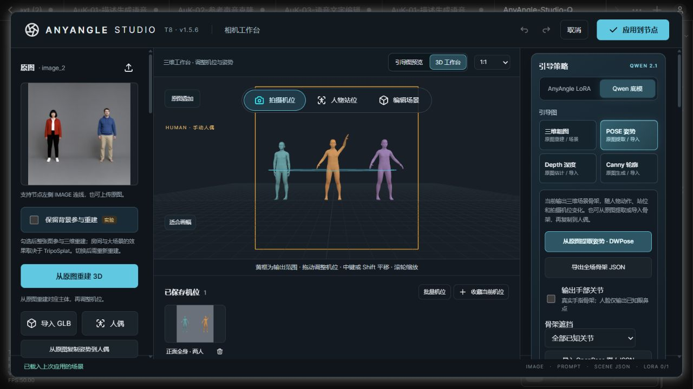

# 1.5.6 联合检查

[简体中文](#检查记录) · [English](#english)

2026-10-05，基于 v1.5.5（`b86a7963`）重新实测 20 个范围：主 Agent 10 项前端交互，独立子 Agent 10 项后端，并交叉复核修复。

确认并修复两类问题：

- **骨骼旋转操作没有结束。** 原生 FK 旋转环按住时撤销、切换人物或关节、编辑控件、锁定或切模式，旧控件仍保持拖动状态；失去鼠标捕获也一样。现在结束原生控件、移除拖动监听并释放捕获，再进行新操作。开始拖动时的历史记录不会误取消这次操作。修复前 10 项原生浏览器探针中，正常松开通过，另外 9 项失败；修复后全部通过。
- **失败保存留下永久引导图。** 尺寸不符或含非有限数值的快照/便携场景请求虽返回错误，PNG 已写入存储。现在先完成图片方向正规化、画幅校验与文档序列化，再写入文件。这两种输入校验失败不再增加孤立 PNG；有效 EXIF 旋转图片仍可保存。

## 检查记录

| 项 | 实测范围 | 结果 |
| --- | --- | --- |
| 1 | FK 正常松开、撤销和重做 | 真正旋转环改变关节四元数；一次撤销恢复，重做恢复旋转结果。 |
| 2 | FK 按住时撤销 | Ctrl+Z 后控件结束；继续移动和松开不改恢复后的姿势。 |
| 3 | FK 按住时切换人物 | Alt+方向键切人后旧控件结束，不改新人物。 |
| 4 | FK 按住时编辑相机数字 | 结束旋转时保留控件的新数值，后续指针移动不改姿势。 |
| 5 | FK 按住时改变俯仰开关 | 开关值保留；旧旋转结束，不再继续改骨骼。 |
| 6 | FK 按住时选择其他关节 | 新关节不会接续上一关节的旋转起点。 |
| 7 | FK 按住时切相机模式 | 控件结束，原姿势保持在切换时的位置。 |
| 8 | FK 按住时锁定人物 | 锁定后旧指针不再改姿势。 |
| 9 | FK 丢失指针捕获 | 原生 releasePointerCapture 后停止旋转，保留最后有效姿势。 |
| 10 | FK pointercancel | 取消事件正确结束控件，随后移动不再改变姿势。 |
| 11 | 拒绝保存与 EXIF 方向 | 12 次错误快照/便携场景请求不改存储字节；有效旋转 PNG 恢复成功。 |
| 12 | 坐标置信度和画布边缘 | 像素与归一化单位共 8 组；空人物输出合法黑图，缺失腿不补造。 |
| 13 | 非法坐标和身体布局 | 15 次坏尺寸、布局、非有限手/脸坐标明确拒绝，不发布文件。 |
| 14 | 首帧和可选部位 | 后续无关或坏帧不影响首帧签名；BODY_25、缺省手/脸及 97×65 画布保留。 |
| 15 | 场景来源切换 | 实际 Studio 执行人偶→GLB→人偶→Splat→人偶；保留角色身份，输出清单匹配当前来源。 |
| 16 | 原生动态图片入口 | 实际 V3 finalized schema 的 actor_reference_100 正确解析；隐藏人物及首张 batch 警告正确，快照未被修改。 |
| 17 | Unicode 姿势存档 | 保存、下载、重复内容去重及小数精度正确；4 次坏旋转不改存储。 |
| 18 | 实际 multipart 图片 | CMYK JPEG、无损 WebP、16 位 PNG 与 Unicode 文件名；正规化后的 RGB 像素一致。 |
| 19 | 原生 Qwen CPU 编码 | 0/32/96 三种参考预算、共享照片去重、引导 batch 首帧；调用真实编码源码，CLIP/VAE 使用小型接口对象。 |
| 20 | deflate 场景 ZIP | 错画幅、非有限元数据、多余成员、资产哈希四种坏包原子拒绝；原包仍能复用并恢复相同 token。 |

完整回归：**224 项 JavaScript + 103 项 Python，327 项全部通过**。本轮新增 **10 项原生 FK 浏览器测试**，原有 18 项相机/IK 交互也通过。子 Agent 重跑 10 项并追加 **3 项独立复核**：70°/25° 斜视中的撤销/重做，以及拖动中删除、隐藏人物后的双次撤销；后端新增探针通过 **63 个真实隔离 HTTP 请求**，主 Agent 再复核两种错误保存端点。

Intel D3D11 回归覆盖 36 种 DPR/画幅/镜头组合、32 种原生平移组合、精确机位收藏重放、批量输出和四种引导图。100 次切人后保持 16 几何体/10 纹理，空闲一次绘制。本地 ComfyUI v1.5.6 实际旋转关节再撤销，恢复原角度；测试草稿已取消，保存的三人场景未改。

本轮未重跑大型模型生成或 ONNX 权重；CPU 编码使用真实 Qwen 编码入口及小型 CLIP/VAE 接口。上述校验失败无文件副作用不等于磁盘故障下的多文件事务。[已有生成实测与限制](multi-person-validation.md)仍适用。

更新后重启 ComfyUI，关闭旧工作台并按 `Ctrl+F5` 刷新，确认标题 **T8 · v1.5.6**。

## English

A fresh 20-scope parent/child audit against v1.5.5 reproduced and fixed two defect classes:

- Native FK rotation could stay active across undo, actor/bone switches, control edits, locking, mode changes or pointer cancellation/lost capture. The adapter now completes the native control and releases its listener/capture before another operation. Initial history recording does not cancel a newly started gesture. The original native browser baseline passed normal release and failed the other nine cases; all ten now pass.
- Rejected snapshot/portable-scene saves could leave a permanent PNG when dimensions disagreed or metadata contained nonfinite values. Image orientation, dimensions and JSON serialization now complete before files are published. Valid EXIF-oriented captures remain supported. This input-validation fix does not claim multi-file transactional recovery from disk failure.

All **224 JavaScript and 103 Python tests passed**. Ten new native FK interaction cases and the existing 18 camera/IK cases passed on Intel D3D11. The child agent repeated the ten cases and added three independent checks: held undo/redo at an oblique view, actor deletion with two-step undo, and hiding/restoring an actor during rotation. Backend probes covered **63 real isolated HTTP requests**, followed by the parent's verification of both rejected-save endpoints. The table records coordinate/confidence borders, bad layouts, first-frame behavior, source transitions, native V3 Autogrow, Unicode poses, three real image formats, native Qwen CPU encoding and corrupt deflated scene archives.

Additional hardware regression verified **36 DPR/frame/lens combinations**, **32 native pan combinations**, exact bookmark replay, batch restoration and all four guides. Repeated actor switching retained 16 geometries and 10 textures with one idle draw. The actual local ComfyUI v1.5.6 workbench also passed native joint rotation and undo; the test draft was cancelled and the saved scene restored.

Large-model generation and ONNX weights were not rerun. Native Qwen CPU encoding used small CLIP/VAE interface objects. [Existing generation evidence and limitations](multi-person-validation.md#english) remain applicable. Restart ComfyUI and reload the closed studio with `Ctrl+F5`; confirm **T8 · v1.5.6**.
