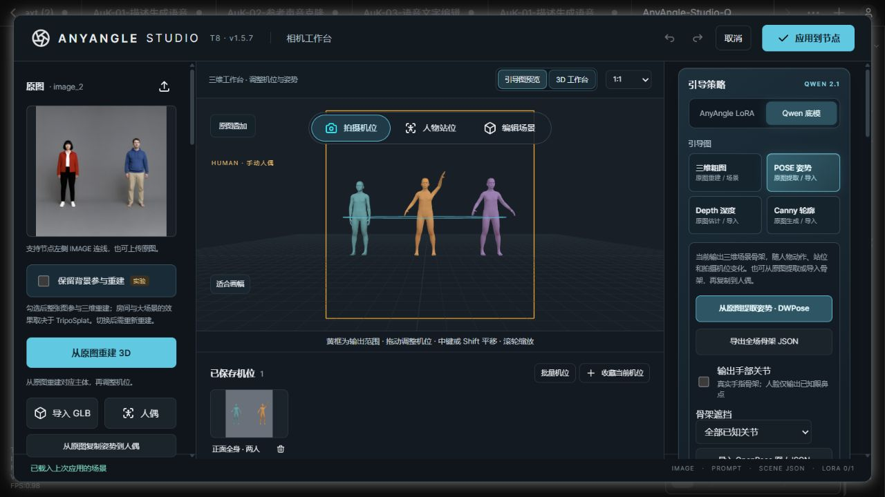

# 1.5.7 联合检查

[简体中文](#检查记录) · [English](#english)

2026-10-05，基于 v1.5.6（`34ecd90d`）重新检查 20 个范围：主 Agent 10 项工作台交互，独立子 Agent 10 项后端，并交叉实测修复。

确认并修复两类问题：

- **Canny 零阈值误报边缘。** 两个阈值均为 0 时，零梯度也进入强边缘队列，纯色原图生成近乎全白的引导图。现在 Sobel 按邻居差值计算，排除零梯度；0 阈值继续可用，真实边缘保留。原版实际工作台把纯灰图输出为 1,014,045 个白像素，修复后为 0。这里修复的是常量区域误报，不声称与 OpenCV 所有像素完全相同。
- **无移动的关节点选清空重做。** 点击原生 IK 手部或 FK 旋转环但不拖动，也会创建历史并清空旧重做。现在指针操作结束时比较开始和结束姿势，无变化则恢复历史；真正拖动仍正常保存，支持撤销、重做和取消事件。程序调用的姿势修改保留原来的历史流程。

## 检查记录

| 项 | 本轮实测范围 | 结果 |
| --- | --- | --- |
| 1 | 纯灰原图上传、Canny 0/0 与实际保存 PNG | 修复后输出黑图，阈值仍为 0。 |
| 2 | 阶跃原图 Canny 0/0 | 保留中间边缘，两侧常量区域不被填白。 |
| 3 | 导入深度图后移动、转向人物及撤销 | 静态深度 PNG 不被三维人偶修改。 |
| 4 | 三维深度翻转 | PNG 改变，人物和相机不变；撤销恢复原 PNG。 |
| 5 | 双人 POSE → Depth → Canny → 粗图 → POSE | 人物与相机一致，各模式可实际输出。 |
| 6 | 取消姿势选人窗口 | 人物不改，之前的重做记录保留。 |
| 7 | 复制姿势到当前人后撤销 | 保留其他人物、身份与相机；撤销恢复全场人物。 |
| 8 | 自定义提示词、图片换序、切引导图、重新打开 | 空白、换行与 image3 原文完整保留。 |
| 9 | 原生 FK 旋转环单击不动 | 保留旧重做，可重放之前的 62° 相机编辑。 |
| 10 | 原生 IK 手部单击不动 | 保留旧重做，可重放之前的 62° 相机编辑。 |
| 11 | 9 个混合版本/引导图机位、重排与重复 task ID | 下载 ZIP CRC 与实际 PNG 字节一致，Unicode 标识保留。 |
| 12 | 批量缺失机位与 8 次并发有效重试 | 坏批次拒绝；有效重试去重到同一批次。 |
| 13 | 便携场景导入新的临时存储 | 隐藏人物身份、模板、共享照片、道具和双人接触保留。 |
| 14 | 旧派生提示词/图片清单的压缩 ZIP | 导入后重建当前映射，再导出保持规范 token。 |
| 15 | 坏接触目标、模板坐标、相机目标、角色/道具 ID 冲突 | 拒绝时不改现存存储字节，随后有效重试成功。 |
| 16 | 实际 Studio：五人重排、一人隐藏、稀疏共享图片入口 | 四人按 ID 对应，两张照片去重；引导图编号同步。 |
| 17 | 已连接的外部 POSE / Depth / Canny 更新 | 静态旧图拒绝陈旧输入；三维场景图保持保存的输出。 |
| 18 | 实际 Studio：双人 POSE_KEYPOINT 与第一帧 | 忽略无关尾帧；静态第一帧变化拒绝，编辑后的三维姿势正确保留。 |
| 19 | 原生 Qwen CPU 编码：12 人共用照片、自定义提示词 | 两张图片去重，保留原文及预期 latent 形状。此为接口合同检查，不是 12 人生成质量证据。 |
| 20 | 原生编码器 VAE 中断、陈旧提示词与后续恢复 | 错误不修改保存状态；新执行正常完成。 |

本轮前端使用实际工作台 DOM、原生 Chromium/Intel D3D11、真正 IK/FK 控件与 PNG；上传存储和姿势候选响应由隔离测试提供。后端使用真实路由、存储、Studio 与原生 Qwen 编码入口，共 **40 次隔离 HTTP 请求**；CLIP/VAE 为小型接口对象。

独立交叉复核新增 **12 项原生浏览器检查**：4 种不同颜色/尺寸常量图、1 种阶跃图、3 次实际 UI 原图上传提取，以及 IK/FK 无移动的松开、取消与后续正常拖动。原版独立常黑图探针有 2,755 个错误白像素，修复后常量图均为 0；真实拖动仍清空过时重做并正确撤销/重做。

完整回归：**226 项 JavaScript + 103 项 Python，329 项全部通过**。完整 Intel D3D11 实测包含本轮 10 项和原有 28 项相机/IK/FK 交互、36 种 DPR/画幅/镜头组合、32 种原生平移组合、精确机位重放、批量和模板恢复。100 次切人前后保持 16 几何体/10 纹理，空闲一次绘制。模板测试等待新增模板选项实际出现后再编辑人物，保持严格的姿势、站位和 PNG 恢复比对。

本地 ComfyUI 已实际加载 **T8 · v1.5.7**，相机编辑撤销后可重做到 62°。测试草稿已取消，原保存的三人场景和机位已恢复。本轮未加载大型生成模型或 ONNX 权重；[已有生成实测与限制](multi-person-validation.md)继续适用。

更新后重启 ComfyUI，关闭旧工作台并按 `Ctrl+F5` 刷新，确认标题 **T8 · v1.5.7**。此前保存的错误引导图需要重新生成并应用到节点。

## English

A fresh 20-scope parent/child audit against v1.5.6 reproduced and fixed two defect classes:

- With both Canny thresholds set to zero, zero gradients became strong edges and filled constant regions. Sobel now sums paired neighbour differences and ignores zero gradients. Zero thresholds remain valid and real step edges remain detectable. This fixes constant-region false positives; it does not claim pixel equivalence with OpenCV.
- Clicking a native IK marker or FK rotation ring without moving erased existing redo. The adapter now restores history when a completed pointer gesture leaves the pose unchanged. Real drags and programmatic pose edits retain their normal history behavior.

The ten fresh frontend scopes cover actual uploads/captures, static depth stability, depth inversion, two-person guide switching, pose-picker cancellation, copying to the current actor, exact custom prompt restoration and native no-motion FK/IK selection. The ten backend scopes cover mixed-version batch archives, concurrent retry deduplication, portable scenes, regenerated derived metadata, rejected documents, sparse shared identity sockets, external guide changes, first-frame keypoints and native Qwen CPU encoding/recovery. **40 actual isolated HTTP requests** passed.

An independent child verified **12 additional native browser cases**: four constant Canvas images, one step image, three actual UI uploads and four IK/FK no-motion release/cancel cases followed by genuine drags and undo/redo. The original independent black image produced 2,755 false edge pixels; constant images now produce zero. Frontend upload storage and detected-person responses are test-owned fixtures. Backend probes call the real Qwen encoder with small CLIP/VAE interface objects; twelve-person contract validation is not evidence of twelve-person generation quality.

All **226 JavaScript and 103 Python tests passed**. Full Intel D3D11 regression covered the ten new editor cases, 28 existing camera/IK/FK interactions, 36 DPR/frame/lens combinations, 32 native pan combinations, exact bookmark replay and batch/template restoration. One hundred actor switches retained 16 geometries and 10 textures with one idle draw. The template test waits for the newly saved option before editing; strict pose, transform and PNG comparisons remain.

Actual local ComfyUI loaded **T8 · v1.5.7** and replayed a 62° camera edit after undo. The test draft was cancelled and the saved three-person scene restored. Large inference models and ONNX weights were not rerun; [existing generation evidence and limitations](multi-person-validation.md#english) remain applicable. Restart ComfyUI, close the old studio and reload with `Ctrl+F5`. Regenerate and apply any previously saved incorrect guide.
