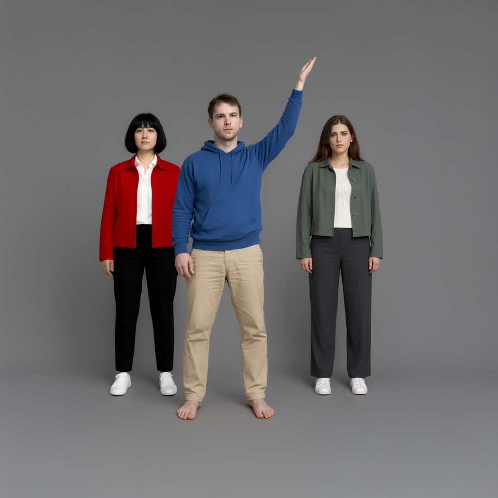
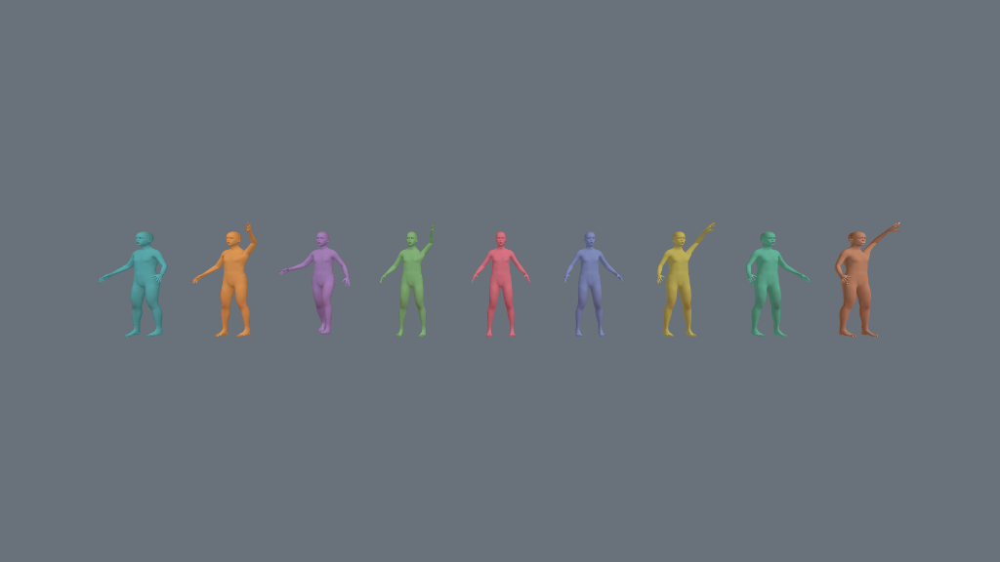
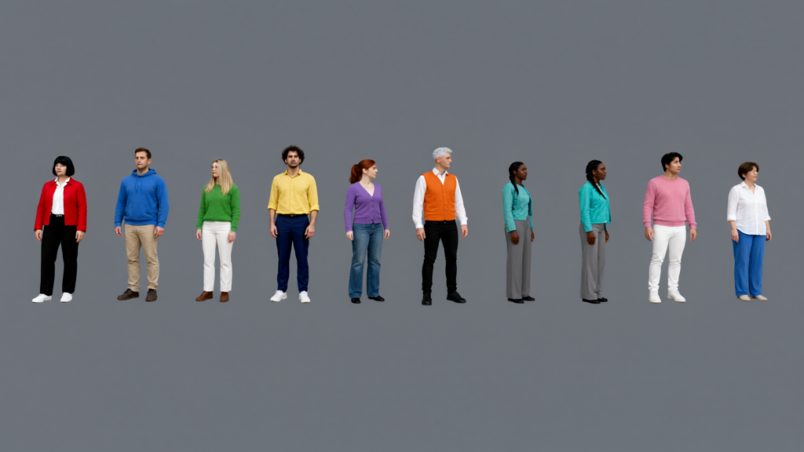
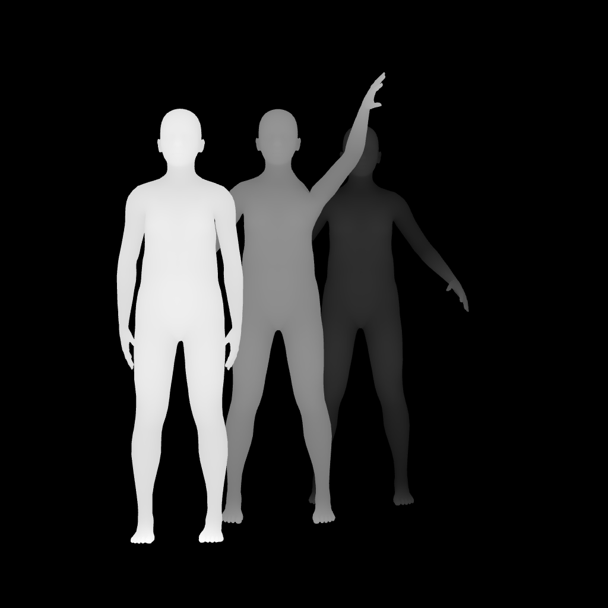
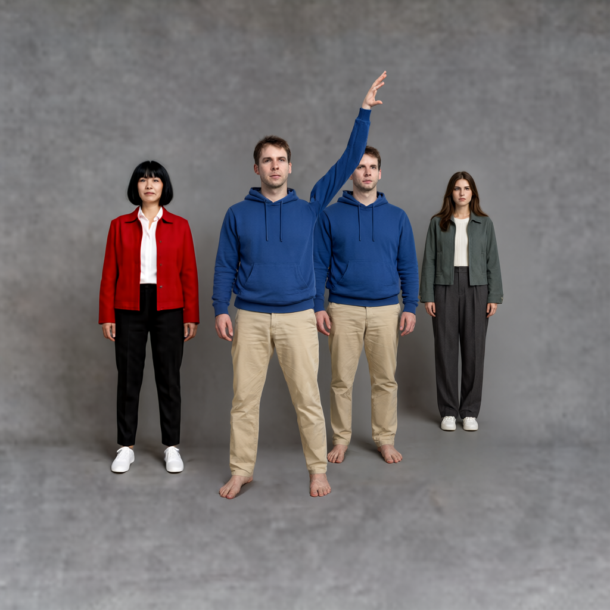

# 多人工作台实测 · v1.5.0

[简体中文](#多人工作台实测--v150) · [English](#english) · [返回 README](../README.md)

2026-10-04 在实际 ComfyUI 中完成 **39 张原生 Qwen 出图**。执行均成功，但生成质量没有全部达标。以下图片是实际节点引导图及原生工作流输出，未后期修正人物动作、人数或构图。身份参考为原创 AI 虚构人物。

## 环境与复现

- Windows，RTX 5090 Laptop 24 GB；ComfyUI 0.36.0、前端 1.53.6。
- 模型：`qwen_image_2.1_int8_convrot.safetensors`；编码器：`qwen3vl_8b_int8_convrot.safetensors`；VAE：`qwen_image_2.1_vae_bf16.safetensors`。
- 20 步、CFG 3、euler/simple、denoise 1、AnyAngle 强度 0；首张为引导图，人物照片默认 512 面积预算。
- 2/3/5 人为 1024 × 1024；9 人为 1024 × 576。主矩阵使用种子 42 和 314159；照片案例为 42，修复后 Canny 追加两个种子。
- [多人工作流](../workflows/AnyAngle-Studio-Qwen21-MultiPerson.json) → Studio →「全场模板与便携场景」→ 导入 [三人照片 POSE 场景 ZIP](../examples/multi-person-photo-pose.zip) → 应用 → 运行。ZIP 包含人物、动作、机位与参考资源，已在实际 UI 导入并回读验证。
- [逐图记录与 SHA-256](multi-person-validation.json) 包含 39 个 prompt ID、运行状态、输出散列和独立目视结论。JSON 不包含本机目录或凭据。

## 主矩阵：32 张

这些案例只使用文字外观，**不验证照片身份相似度**。`PASS_WITH_LIMITATIONS` 表示人数、主要动作和适用的遮挡基本符合，仍有小误差；`PARTIAL` 表示动作只部分遵循；`FAIL` 表示关键动作、人数或遮挡明显不符。判断来自逐图目视检查，不是统计可靠率。

| 人数 | 编排 | 引导 | seed 42 | seed 314159 | 实际人数 42 / 314159 |
|---|---|---|---|---|---|
| 2 | 分开 | 粗图 | FAIL | FAIL | 2 / 2 |
| 2 | 分开 | POSE | PASS_WITH_LIMITATIONS | PASS_WITH_LIMITATIONS | 2 / 2 |
| 2 | 遮挡 | 粗图 | FAIL | PASS_WITH_LIMITATIONS | 2 / 2 |
| 2 | 遮挡 | POSE | PASS_WITH_LIMITATIONS | PASS_WITH_LIMITATIONS | 2 / 2 |
| 3 | 分开 | 粗图 | FAIL | FAIL | 3 / 3 |
| 3 | 分开 | POSE | PARTIAL | PARTIAL | 3 / 3 |
| 3 | 遮挡 | 粗图 | FAIL | FAIL | 3 / 3 |
| 3 | 遮挡 | POSE | FAIL | FAIL | 3 / 3 |
| 5 | 分开 | 粗图 | FAIL | FAIL | 5 / 5 |
| 5 | 分开 | POSE | PASS_WITH_LIMITATIONS | PASS_WITH_LIMITATIONS | 5 / 5 |
| 5 | 遮挡 | 粗图 | FAIL | FAIL | 5 / 5 |
| 5 | 遮挡 | POSE | FAIL | FAIL | 5 / 5 |
| 9 | 分开 | 粗图 | FAIL | FAIL | 10 / 10 |
| 9 | 分开 | POSE | FAIL | FAIL | 11 / 11 |
| 9 | 遮挡 | 粗图 | FAIL | FAIL | 9 / 9 |
| 9 | 遮挡 | POSE | FAIL | FAIL | 12 / 12 |

总计 **7 基本符合、2 部分符合、23 失败**。人数、文字衣装与顺序各有 26/32 正确。粗图主要动作符合 1/16；POSE 为 6/16 符合、2/16 部分符合。粗图经常把举臂改为下垂；遮挡常被摊平；9 人会增员。因此这版支持多人编排与输出，**不能据此宣称稳定生成九人或精确遮挡**。

## 照片参考：5 张 + 修复后 Canny 2 张

| 案例 | 实际人数 | 结果 |
|---|---|---|
| 双人照片 POSE · 42 | 2 | 衣装、顺序、举左臂符合；人物尺寸和男性脸部有漂移 |
| 三人照片 POSE · 42 | 3 | 衣装、顺序、举臂符合；第三人脸部、发型变化 |
| 三人遮挡粗图 · 42 | 3 | 后方绿衣人物变大并前移，动作未遵循 |
| 三人场景 Depth · 42 | 4 | 蓝衣人物重复，动作与深度关系错误 |
| 三人 Canny 修复前 · 42 | 3 | 引导图无轮廓，不能作为有效 Canny 质量案例；输出有紫底和错误举臂 |
| 三人 Canny 修复后 · 42 / 314159 | 3 / 3 | 轮廓有效，衣装顺序、蓝衣人物举左臂符合；第三人动作与前后布局仍不符 |

双人参考使用真实 DWPose 提取、选人并绑定合影区域；第三人使用独立照片。此处“身份符合”仅指目视外观与衣装相似，不能证明精确人脸身份锁定。

| 参考 | 三人 POSE 引导 | 实际最终图 |
|:---:|:---:|:---:|
|  |  |  |

### Canny 修复实测

角色色与灰背景对比不足，默认 50/150 阈值没有强边缘种子，原图全黑。修复采用同机位高对比灰模提取人偶/GLB 几何轮廓，兼容双面 GLB，完成后恢复原材质、背景和控件。原图 Canny 不改变源像素，TripoSplat 保留颜色渲染。

同一场景完整数据保持不变，1024² 引导图有 **19,599 个边缘像素**，两个种子均实际重跑。原先紫底消失；但第三人外展动作仍变成下垂，后排位置不准确，314159 还改变了红蓝遮挡关系。因此修复了空引导图缺陷，未把模型的构图遵循宣称为成功。

| 实际修复后轮廓 | seed 42 · 布局有偏差 | seed 314159 · 遮挡有偏差 |
|:---:|:---:|:---:|
|  |  |  |

用户仍可选择很高阈值或空白来源。工作台显示空轮廓警示，允许应用、导出和批量继续；实际 UI 已验证合法全黑 PNG 可保存。批量完成恢复原机位时，轮廓警示也恢复，不串用最后一个机位的状态。

### 未达标案例

| 9 人粗图 → 实际 10 人 | 三人 Depth → 实际 4 人 |
|:---:|:---:|
|  |  |

## 契约与性能

- 162 项 JavaScript + 85 项 Python 回归通过；1,440 种前后端映射组合及 216 种首次自定义提示词切换组合一致。原生编码器用实际 `images` 字典完成 17 图 CPU 接口探测；没有人为拒绝或截断超过建议数量的输入。
- 官方说明支持最多 [10 张参考图](https://huggingface.co/Qwen/Qwen-Image-2.1)，本工作流把引导图计入参考预算。输入可运行不代表大规模多人质量经过保证。
- 实际 UI 验证静态原图不误用保留的三维人物数量；自定义提示词保留原文及空文本；照片编号、共享去重与 latent 画幅同步。
- 36 种 DPI/画幅/焦距组合的相机投影检查通过；离屏导出不改变可见画布尺寸或实时相机。100 次九人切换后几何体与纹理数保持稳定，闲置按需渲染。
- 实际 IAB 闲置九人约 76.8 秒：主线程 CPU 6.60%，渲染进程 13.92% 单核，JS heap 90.35 MB。九人自动拖动约 3.10 秒：回调中位 1.09 ms、P95 1.52 ms，合成约 52.60 帧/秒；主线程 61.78%、渲染进程 87.22% 单核，heap 95.38→97.10 MB。

拖动只有 36 个指针事件与 32 次按需回调，**不是持续 Studio FPS 测试**。CPU、heap 与合成数据覆盖整个 ComfyUI 浏览器页面，当时同时运行 Qwen 与其他应用。不能推断所有机器都能达到同一性能。冷启动、并发 GPU 工作负载会影响推理耗时。

先用少量人物、明确站位和 POSE 试图；复杂遮挡、近距离互动与隐藏肢体逐张检查。工作台输出结构引导，最终遵循由 Qwen 模型和采样设置决定。

## English

**39 native Qwen outputs were generated on 2026-10-04. All executions succeeded; image quality did not pass every case.** Guides and final images above are actual exports and inference results. They were not edited to correct people, poses or layouts. Identity references depict original AI-generated fictional people.

**Reproduction:** Windows, RTX 5090 Laptop 24 GB, ComfyUI 0.36.0 / frontend 1.53.6. Model: `qwen_image_2.1_int8_convrot.safetensors`; encoder: `qwen3vl_8b_int8_convrot.safetensors`; VAE: `qwen_image_2.1_vae_bf16.safetensors`. Use 20 steps, CFG 3, euler/simple, denoise 1, AnyAngle 0, guide first and the default 512 actor-photo area budget. 2/3/5-person cases are 1024²; nine-person cases are 1024 × 576.

Load the [multi-person workflow](../workflows/AnyAngle-Studio-Qwen21-MultiPerson.json), import the [three-person photo POSE ZIP](../examples/multi-person-photo-pose.zip) through **全场模板与便携场景 → 导入场景 ZIP**, Apply and run. The ZIP includes actors, poses, references and camera; it was imported and read back in the real UI. The [per-image receipt](multi-person-validation.json) contains prompt IDs, hashes, execution states and independent visual findings without local paths or credentials.

**Main matrix:** the table above contains all 32 outputs: 2/3/5/9 people × separated/occluded × coarse/POSE × seeds 42/314159. These use text descriptions, not identity photos. `PASS_WITH_LIMITATIONS` means count, main actions and applicable occlusion broadly match; `PARTIAL` means incomplete action adherence; `FAIL` means a material pose/count/occlusion mismatch. This is a small visual review, not a reliability estimate.

There were **7 passes with limitations, 2 partials and 23 failures**. Count, text-described clothing and order were each correct in 26/32. Coarse matched main actions in 1/16; POSE matched 6/16 and partially matched 2/16. Coarse often lowered raised arms; depth ordering flattened. Nine-person guides produced 10–12 people in six cases, while two retained nine but missed poses/layout. This version supports cast editing and shared exports; it does not demonstrate reliable nine-person generation or exact occlusion.

**Photo tests:** the two- and three-person POSE examples preserve count, clothing order and the raised left arm, with face, hair and size drift. The three-person occluded coarse result flattens/reverses depth. Scene Depth produces four people by duplicating the blue actor. DWPose selection and shared source regions were tested with an actual group reference. Visual resemblance is not proof of exact facial identity locking.

**Canny correction:** the original colored scene had insufficient contrast for 50/150 thresholds and exported a blank map. The corrected mannequin/GLB pass renders high-contrast, double-sided clay with the same camera, then restores materials, background and helpers. Photo Canny uses original pixels; TripoSplat keeps its color render. Scene data is unchanged. The corrected 1024² guide has 19,599 visible edge pixels; both seeds were actually rerun.

Both corrected outputs show three distinct people, correct clothing order and the blue actor's raised left arm; the purple background disappears. The green actor's extended arm still lowers and the rear placement differs; seed 314159 also reverses red/blue occlusion. Under full-pose/layout criteria both remain failures. The images above preserve those differences. An intentional blank Canny map remains exportable with a visible warning; real Apply/save and batch-state restoration were verified.

**Contract checks:** 162 JavaScript and 85 Python tests pass. 1,440 legal frontend/backend mappings and 216 first-custom-prompt transitions agree. A native encoder CPU probe consumes all 17 supplied images; exceeding the suggested budget is not artificially rejected or truncated. Qwen's [official card documents up to 10 references](https://huggingface.co/Qwen/Qwen-Image-2.1); the guide counts toward that budget. Static photo guides do not inherit a retained 3D cast. Custom text, shared-reference deduplication, image tags and latent dimensions were checked through the live UI/backend.

**Performance:** 36 DPI/aspect/focal-length projection combinations pass; offscreen export preserves the display canvas and live camera. Geometry/texture counts remain stable after 100 nine-actor switches. Real IAB nine-actor idle over 76.8 s measured 6.60% main-thread / 13.92% renderer CPU of one core and 90.35 MB JS heap. A 3.10 s automated nine-actor drag measured 1.09 ms median / 1.52 ms P95 callbacks, 52.60 compositor draws/s, 61.78% main-thread / 87.22% renderer CPU of one core, and 95.38→97.10 MB heap.

The drag provides only 36 pointer events and 32 on-demand callbacks; it is **not sustained Studio FPS capacity**. Metrics cover the full ComfyUI renderer with concurrent Qwen inference and other applications. They cannot predict every machine. Start with fewer, clearly separated people and POSE; inspect complex occlusion and interactions in each generated result.
