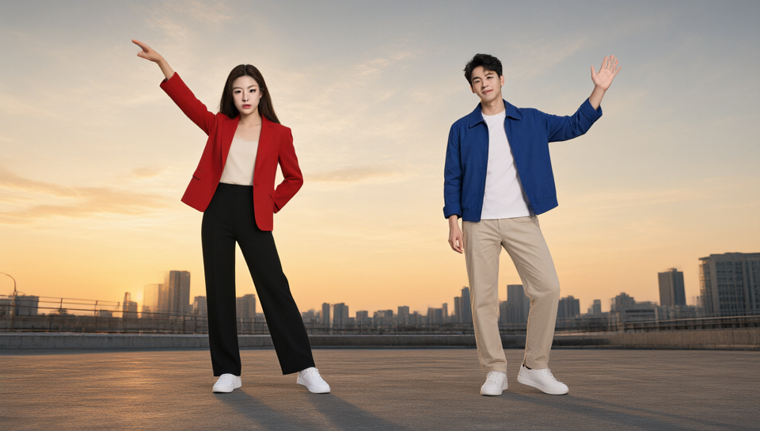
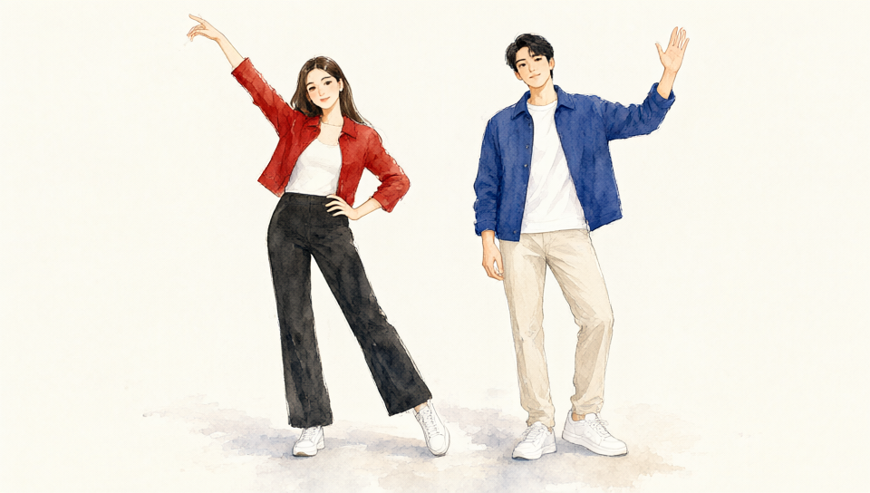
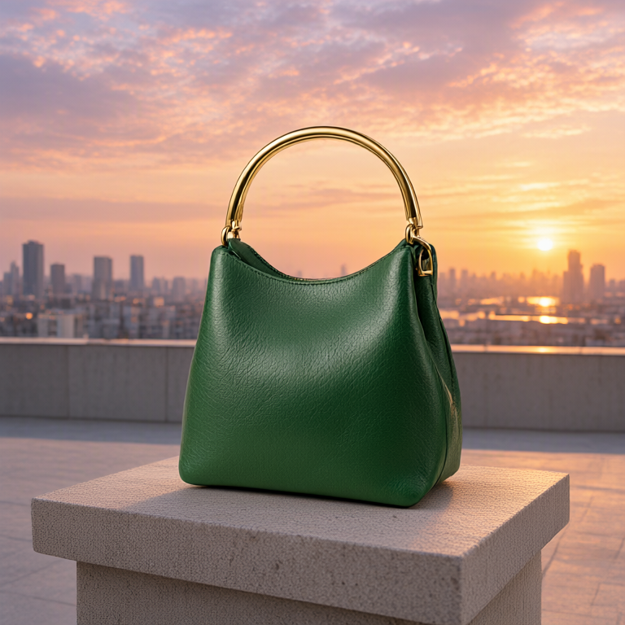

# 多用途参考实测 · v1.6.0

[中文](#多用途参考实测--v160) · [English](#english) · [操作说明](reference-library.md) · [返回 README](../README.md)

2026-10-09，Windows / RTX 5090 Laptop 24 GB，ComfyUI 0.36.0、前端 1.53.6。全部效果图来自本机 ComfyUI，未修正生成图中的身份、动作或布局偏差。[逐项执行记录与图片 SHA-256](reference-library-validation.json)。

## 已验证行为

- 118 项 Python、238 项 JavaScript 测试通过，覆盖新库、旧场景兼容、保存 / ZIP、图号去重、透明素材、首图尺寸、提示词和批量冻结。
- 实际前端载入三个新工作流，验证端口与提示词连线；断开正向输入后，手写文本和负向文本正确进入执行图。
- 实际 UI 验证旧双人场景显式升级、多用途目标绑定、素材去重、引导 / 仅参考来回切换、400 × 500 实际裁切、Apply、无引导快照及便携导出。1660 × 1040 与 860 × 940 窗口均检查。
- 实际原生 Qwen 编码验证完整空提示词、外部正负文本、10 / 11 / 17 图及真实无引导输出。`Studio` 的 IMAGE 为 `None` 时，连接编码器可选引导端口也能执行；未填充灰图。
- 10 / 11 / 17 图测试执行了 Qwen3-VL 与 VAE 编码，未做扩散采样。它证明图片没有被截断，**不证明多图语义控制质量**。批量 `encoding_plan` 是冻结后的提交文本和素材计划；成功出图仍以 history 为准。

## 真实生成结果

共同权重：`qwen_image_2.1_int8_convrot.safetensors`、`qwen3vl_8b_int8_convrot.safetensors`、`qwen_image_2.1_vae_bf16.safetensors`。参考预算为 256，seed 42。普通路线 20 步 / CFG 3 / Euler；Turbo 为作者 r128 LoRA、动态 Sigma、Euler、BasicGuider、6 步，无负向 CFG。

| 案例 | 实际输入与画幅 | 观察 |
|---|---|---|
| 原生 / Turbo 同素材 A/B | 脸、衣装、环境 3 图；768 × 768 | 两者保留红衣与大致人物特征；文字要求咖啡馆与环境图天际线冲突时，没有完全遵循文字场景 |
| 双人三维粗图 + 身份 | 引导 + 2 张参考；960 × 544 | 两个人物、红衣女性 / 蓝衣男性和主要姿势可辨；身份与细节仍是近似 |
| 静态双人 POSE + 风格 | 骨架 + 风格参考；960 × 544 | 两人动作和水彩方向生效；参考衣服与外观也有串用，不能把用途选项理解为隔离蒙版 |
| 纯文本产品素材 | 0 图；1024 × 1024 | 正常生成手袋，不要求场景人物或三维模型 |
| 产品 + 环境 | 配饰 / 手袋 + 环境 2 图；768 × 768 | 零场景人物，产品与环境可组合，金色提手与绿色皮革大致保留 |
| 冲突输入反例 | 三人 POSE + 要求双人的文字 | 实际仍生成三人；保留失败记录，不能把 API 成功算作人数控制通过 |

| 双人粗图与身份的实际成图 | 静态 POSE 与风格的实际成图 | 产品与环境的实际成图 |
|:---:|:---:|:---:|
|  |  |  |

本机 A/B 中原生任务约 94.26 秒，Turbo 约 10.08 秒，但原生为冷加载，Turbo 复用了编码缓存。**这些耗时不是公平加速比测试。** JSON 明确记录 Turbo 编码回执的缓存复用。用途与目标是文字描述；精确身份、区域权重、硬遮罩和持续空间约束不在本功能内。

## 工作流与模型

[多图 GUI](../workflows/AnyAngle-Studio-Qwen21-MultiReference.json) / [API 模板](../workflows/AnyAngle-Studio-Qwen21-MultiReference-API.json) · [仅参考 GUI](../workflows/AnyAngle-Studio-Qwen21-ReferencesOnly.json) / [API 模板](../workflows/AnyAngle-Studio-Qwen21-ReferencesOnly-API.json) · [Turbo GUI](../workflows/AnyAngle-Studio-Qwen21-ViggleTurbo6.json) / [API 模板](../workflows/AnyAngle-Studio-Qwen21-ViggleTurbo6-API.json)。

API 模板不包含本机快照或参考素材。先在 GUI 的 Studio 保存 / 应用，使用本机生成的 snapshot token，或直接导出已应用工作流的 API 格式。纯文本模式需在 Studio 切换后应用。模型来源及安装位置见 [模型与节点](reference-library.md#模型与节点)。

[Qwen 官方](https://huggingface.co/Qwen/Qwen-Image-2.1) 的 10 图建议不是这里的人为截断条件。[Viggle 官方](https://huggingface.co/Viggle/Qwen-Image-2.1-viggle-turbo) 主要测试 1–3 张参考；不能把复杂多图或多人质量推定为已保证。旧版多人质量矩阵保留在 [历史实测](multi-person-validation.md)。

## English

Tested locally on 2026-10-09: Windows, RTX 5090 Laptop 24 GB, ComfyUI 0.36.0 / frontend 1.53.6. All displayed outputs are actual ComfyUI results; identity, pose and layout deviations remain visible. [Execution records and image SHA-256](reference-library-validation.json).

118 Python and 238 JavaScript tests passed. Real frontend checks covered the three workflow graphs, wired / handwritten prompts, explicit legacy upgrade, material targets and deduplication, guided / references-only switching, an actual 400 × 500 crop, Apply, nullable-guide snapshots and portable export. Desktop and narrow layouts were checked. Native Qwen3-VL / VAE encoding accepted empty full text, external positive / negative text and 10 / 11 / 17 references without truncation. The count tests did not perform diffusion sampling and do not establish generation quality. Frozen batch plans describe submission, not completed inference.

The native / Turbo A/B used the same three references and seed 42 at 768 × 768. Both preserved a red outfit and approximate appearance, while the requested cafe conflicted with the skyline reference. A two-person 3D guide plus identity references retained two people and major poses. Static two-person POSE plus a style reference produced a watercolor direction, but clothing and appearance also leaked from the style image. Product + environment worked without actors; text-only product creation used zero images. A deliberately conflicting three-person POSE / two-person text case still produced three people and is recorded as a quality failure.

Native sampling used 20 steps, CFG 3 and Euler. Turbo used the author's runtime r128 adapter, dynamic sigmas, Euler and BasicGuider for six steps, with no negative CFG. Observed A/B task times were 94.26 s and 10.08 s, but native was cold and Turbo reused encoding. These are not a fair speed benchmark. Purposes and targets are text instructions, not regional masks, exact identity locks or independent image weights.

GUI workflows and API templates are linked above. API templates contain no local assets or valid snapshot: Apply in Studio and use the local snapshot token, or export the applied graph from ComfyUI. Model sources and paths are in the [usage guide](reference-library.md#english). Qwen's 10-image recommendation is not enforced by truncation; Viggle's author focuses on 1–3 references, so complex reference quality needs separate assessment.
