# 20 multi-purpose × multi-person teaching cases · v1.6.0

[简体中文](teaching-gallery.md) · [English](teaching-gallery_EN.md) · [Back to README](../README_EN.md)

Every case combines identity, clothing, environment, accessory and style references with two or three people. Environment and accessory images serve multiple purposes; case 20 additionally uses layout. Sources and finals are actual local ComfyUI generations. ImageGen supplied only outfit, empty-environment and accessory materials. Sources and finals are 1536×864; teaching composites are 3840×2160. This page uses 2560×1440 previews. The female identity uses one consistent user-provided reference, while outfits, male characters, environments and visual styles vary.

## Settings and reproduction

Tested 2026-10-09 on RTX 5090 Laptop 24 GB, ComfyUI 0.36.0 / frontend 1.53.6. Qwen Image 2.1 + Viggle Turbo v0.3 r128, Euler, the author's dynamic sigmas, BasicGuider and six steps; no negative CFG or AnyAngle LoRA. Each job encoded six or seven images with a reference budget of 384. These examples are not a speed benchmark.

[Turbo GUI workflow](../workflows/AnyAngle-Studio-Qwen21-ViggleTurbo6.json) · [API template](../workflows/AnyAngle-Studio-Qwen21-ViggleTurbo6-API.json) · [Library usage and models](reference-library.md#english) · [Actual indices, prompts and hashes](teaching-gallery-validation.json). Templates contain no gallery materials or valid local snapshots: add references and Apply first. All 20 local GUI workflows were compiled by the real frontend; all 20 portable scene ZIPs were successfully imported.

Mannequins and splats support camera movement. Photo-extracted POSE, DA3 depth and Canny are static 2D guides. Cases 19/20 send no guide; the environment is image1, and case 20 adds a layout reference. Purposes and targets are image/text guidance, not regional masks or exact identity locks. Actual deviations remain visible: case 1 changes the man's arm pose; case 4 repeats brooches; case 5 shares headphones; case 7 and 17 place objects on the ground. Cases 12/16 have similar stylized male faces, and case 19 mixes clothing patterns. Case 9's initially merged leg points were corrected in the mannequin before recapturing depth. Case 12 was revised to ground the clay figures; case 20 required a layout reference to retain three people. Photo detections for 10/11/13 were visually reviewed to remove duplicate heads or background statues. Single-image splats retain reconstruction defects. See the Chinese per-case observations and JSON for details.

## Cases

### 01 · Rain-harbor cinema

2 people · Mannequin render · 6 actual inputs · `input-full`.

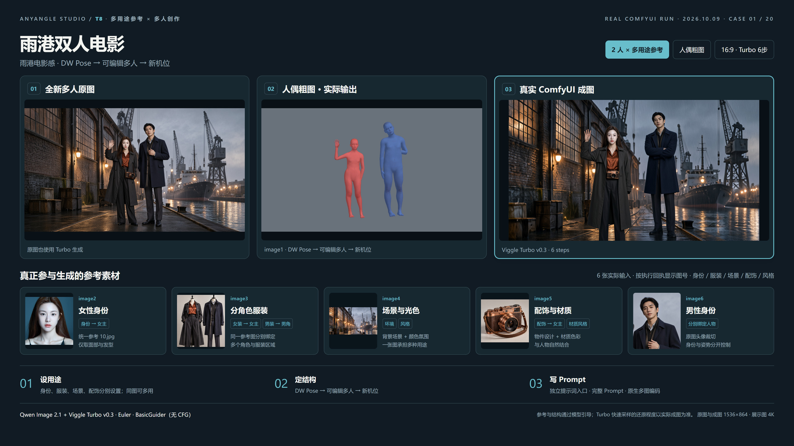

### 02 · Riviera holiday

3 people · Mannequin render · 7 actual inputs · `input-full`.

### 03 · Golden jazz evening

2 people · Mannequin render · 6 actual inputs · `input-full`.

### 04 · Greenhouse watercolor

3 people · POSE · 7 actual inputs · `input-full`.

### 05 · Neon pursuit

2 people · POSE · 6 actual inputs · `input-full`.

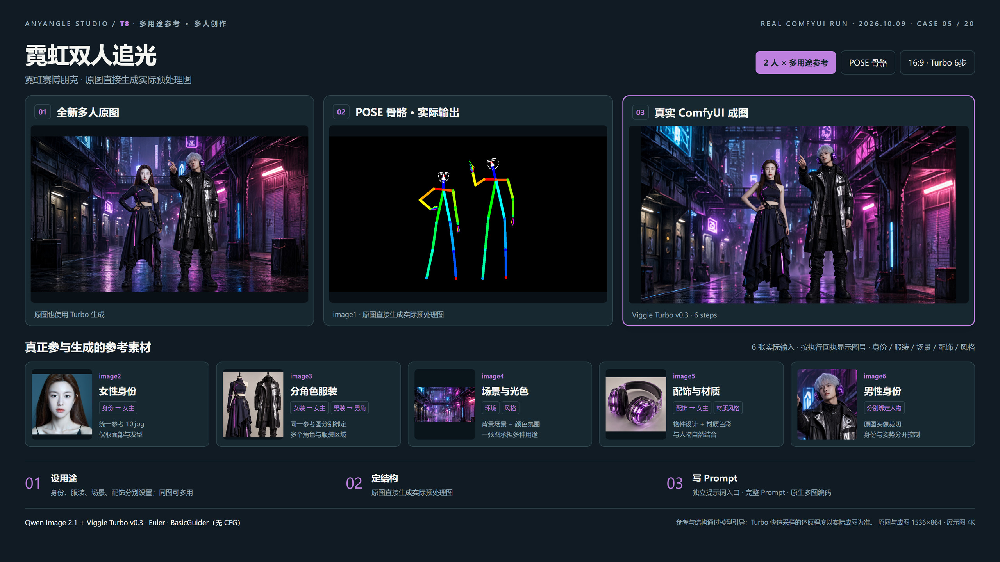

### 06 · Moon-garden ink painting

3 people · POSE · 7 actual inputs · `studio-plus-input`.

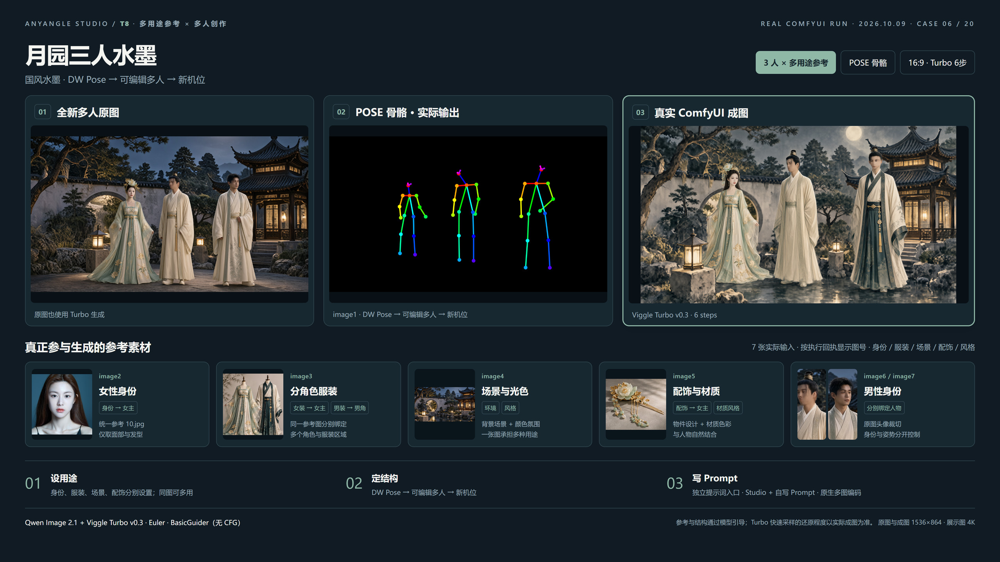

### 07 · Winter magazine

2 people · POSE · 6 actual inputs · `input-full`.

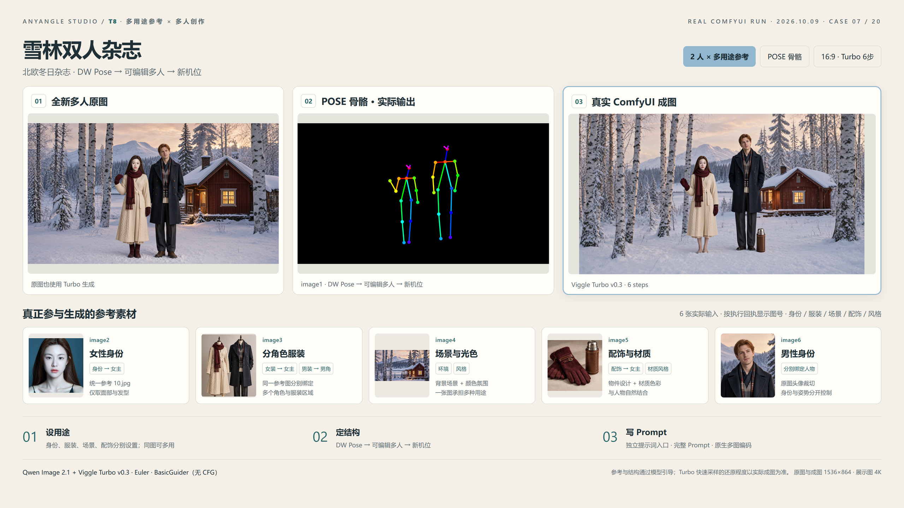

### 08 · Savanna documentary

3 people · Depth · 7 actual inputs · `input-full`.

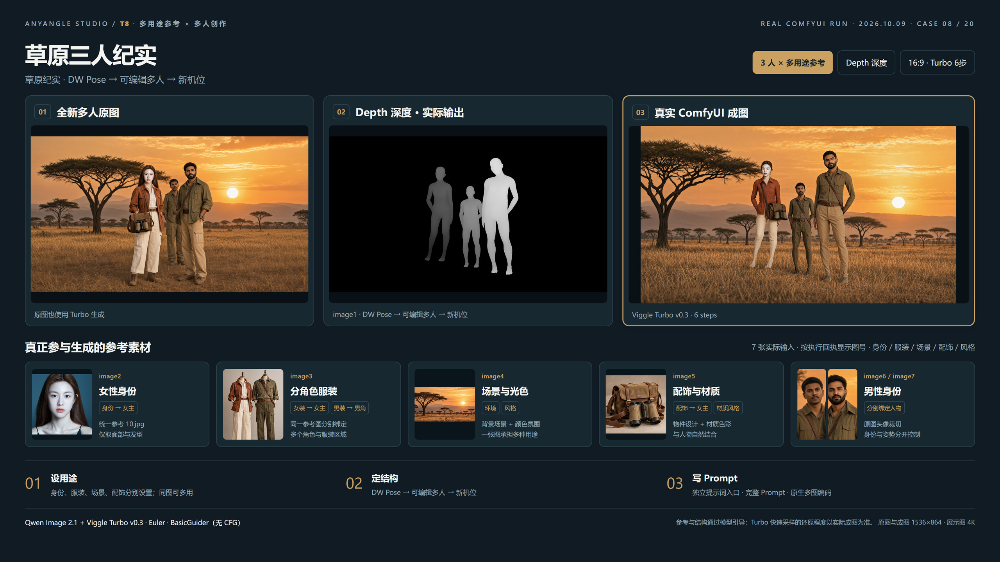

### 09 · Theater dancers

2 people · Depth · 6 actual inputs · `input-full`.

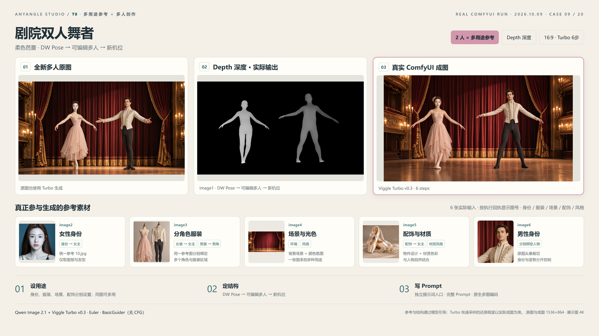

### 10 · Skatepark youth

3 people · Depth · 7 actual inputs · `studio-plus-input`.

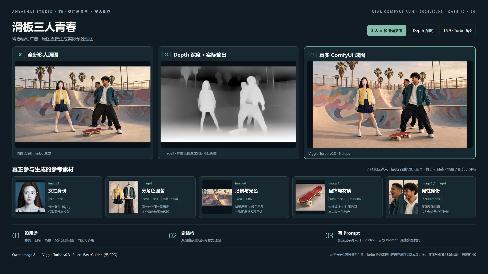

### 11 · Orbital opera

2 people · Depth · 6 actual inputs · `input-full`.

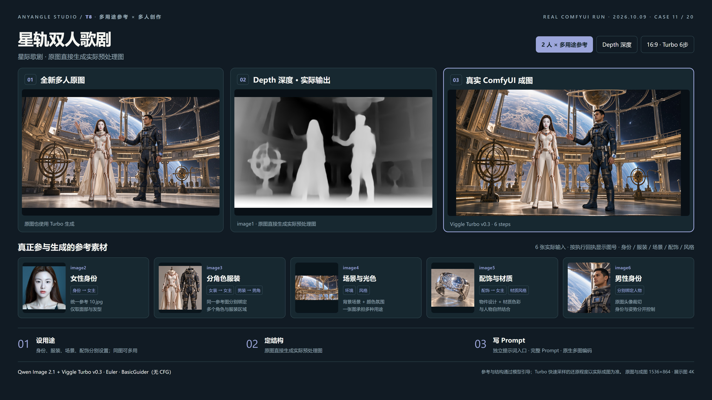

### 12 · Clay harbor

3 people · Canny · 7 actual inputs · `input-full`.

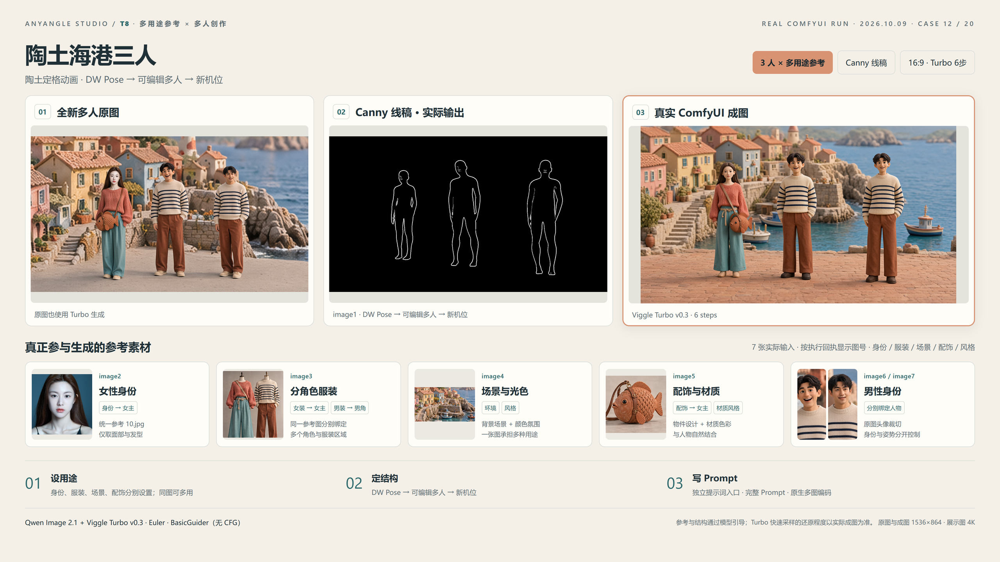

### 13 · Castle oil painting

2 people · Canny · 6 actual inputs · `input-full`.

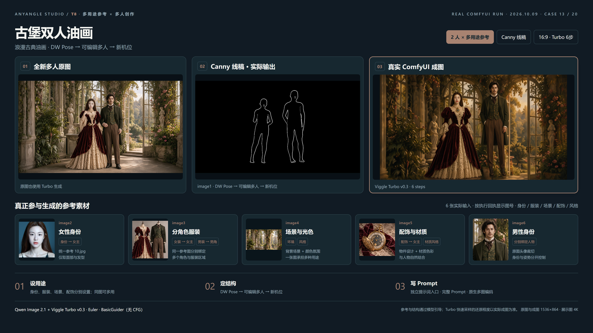

### 14 · Curved-gallery fashion

3 people · Canny · 7 actual inputs · `input-full`.

### 15 · Garden fairytale

2 people · Canny · 6 actual inputs · `input-full`.

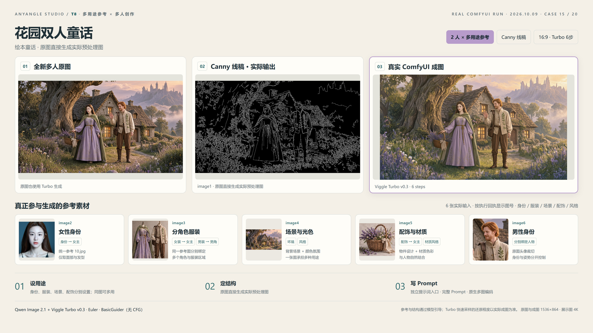

### 16 · Cherry-blossom splats

3 people · Actual TripoSplat camera view · 7 actual inputs · `input-full`.

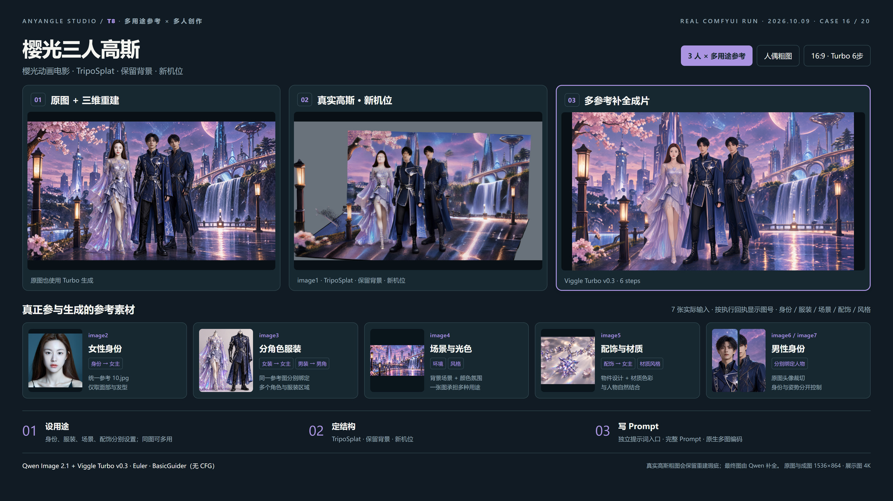

### 17 · Desert film splats

2 people · Actual TripoSplat camera view · 6 actual inputs · `input-full`.

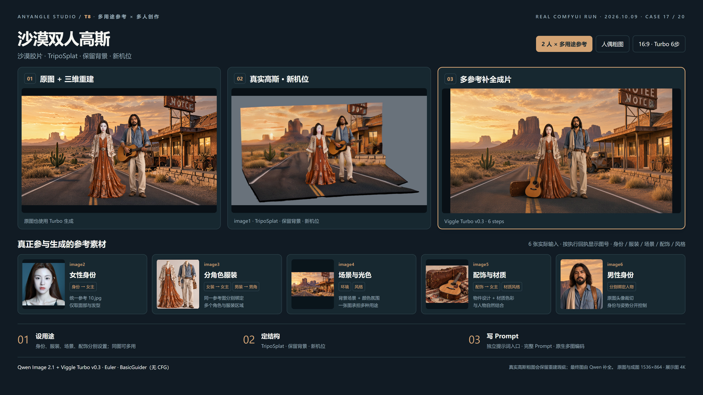

### 18 · Coastal wedding splats

2 people · Actual TripoSplat camera view · 6 actual inputs · `studio-plus-input`.

### 19 · Moon-festival multi-reference

3 people · References only · 6 actual inputs · `input-full`.

### 20 · Alpine-lake layout

3 people · References only · 7 actual inputs · `input-full`.

